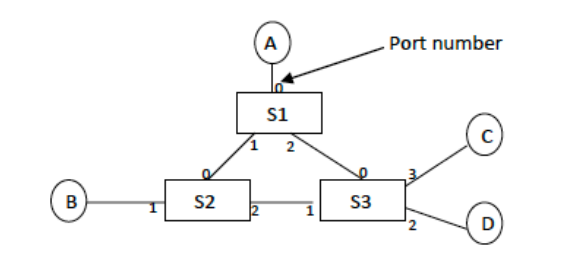

# SDN Project
This is an SDN project that implements this topology:



# Implemented Flows
* "Full flows": Allow all IP and ARP traffic
* "Limited flows": Allow all IP and ARP traffic between A, B, C. D may only engage in ARP with A, B or TCP/IP connections on ports 22 or 80 of either.

# Usage
The project was designed and implemented inside a Mininet VM (get one from here: https://github.com/mininet/mininet/releases).

A ruby file is used to run the various bits and pieces of the project.

## The Network Simulation
In a root environment:

`./run sim`

## Controller (Shell/Ruby)
In a root environment, **after** starting the network simulation:

`./run add_flows`

To add the limited flows:

`LIMITED_FLOWS=1 ./run add_flows`

## Controller (POX)
In a root environment, **before** starting the network simulation:

`./run pox`

To add the limited flows:

`LIMITED_FLOWS=1 ./run pox`

# Demoing the Limited Flow
In the mininet CLI, invoke `dump`. This will give you a list of PIDs:

```xml
<Host A: A-eth0:192.168.60.1 pid=81813> 
<Host B: B-eth0:192.168.61.1 pid=81815> 
<Host C: C-eth0:192.168.62.1 pid=81817> 
<Host D: D-eth0:192.168.62.2 pid=81819> 
```

You can open a specific virtual host's shell as follows:
* `sudo mnexec -a <pid> bash`

A good demo for this project is to open two terminals: Hosts A and D.

Pinging A from D won't work. But if you invoke `python3 -m http.server 80` on A, and try to `wget` that from B, it should work fine, showing that while ICMP is blocked, TCP/IP on port 80 is fine.